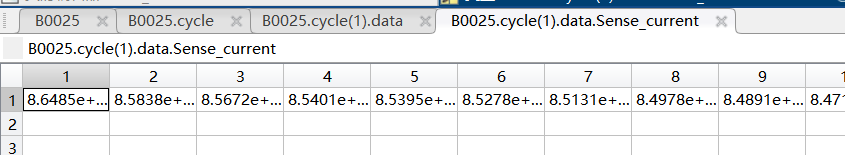
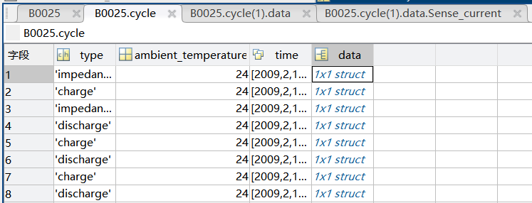
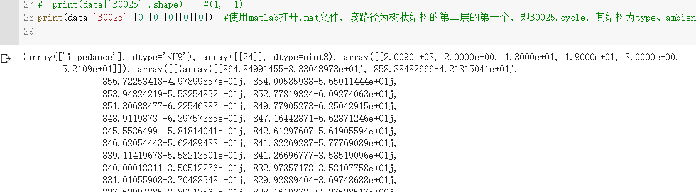
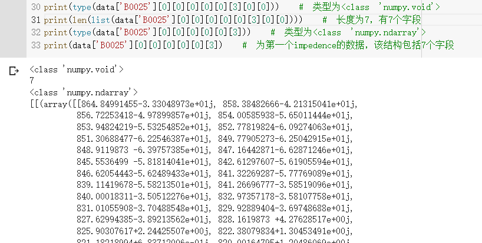

# NASA电池数据的处理

.mat格式是matlab保存数据的一种格式，是树状结构。

以B0025为例：


<center font:"bold">树状结构</center>





```python
# 读取所需电池数据集
import scipy.io as scio

data = scio.loadmat('/content/AutoEncoder-CNN-LSTM--to-prediction-battery-RUL/NASA_PCoE-Datasets_Battery/B0025.mat')
print(type(data)) #dict
# print(list(data.items())[:3])
#[('__header__', b'MATLAB 5.0 MAT-file, Platform: PCWIN, Created on: Fri Apr 17 00:48:28 2009'), ('__version__', '1.0'), ('__globals__', [])]

# print(list(data.items())[3][0]) # B0025，表名
# print(list(data.items())[3][1]) #大量数据，被截断
# print(len(list(data.items())[3][1]))  #长度为1
# print(list(data.items())[3][2])  #不存在
# print(list(data.items())[3][1][0])  #大量数据，被截断
# print(list(data.items())[3][1][1])  #不存在
# print(list(data.items())[3][1][0][0]) #大量数据，被截断
# print(list(data.items())[3][1][0][1]) #不存在
# print(list(data.items())[3][1][0][0][0])  #大量数据，被截断
# print(list(data.items())[3][1][0][0][0][0]) #大量数据，被截断
# print(list(data.items())[3][1][1])  #不存在

# print(type(data['B0025']))  #<class 'numpy.ndarray'>
# print(data['B0025'].shape)  #(1, 1)
```


```python
print(data['B0025'][0][0][0][0][0]) #使用matlab打开.mat文件，该路径为树状结构的第二层的第一个，即B0025.cycle，其结构为type、ambient_temperature、time、data
# print(data['B0025'][0][0][0][0][0]) # impedance\温度为24\6个数据，代表日期\最终数据结构
```






```python
print(type(data['B0025'][0][0][0][0][0][3][0][0]))  # 为第一个impedence的数据，该结构包括7个字段，
print(len(list(data['B0025'][0][0][0][0][0][3][0][0])))  # 为第一个impedence的数据，该结构包括7个字段
print(type(data['B0025'][0][0][0][0][0][3]))  # 为第一个impedence的数据，该结构包括7个字段，
print(data['B0025'][0][0][0][0][0][3])  # 为第一个impedence的数据，该结构包括7个字段，
```




电池的README文档

```markdown
Data Description:
A set of four Li-ion batteries (# 5, 6, 7 and 18) were run through 3 different operational profiles (charge, discharge and impedance) at room temperature. Charging was carried out in a constant current (CC) mode at 1.5A until the battery voltage reached 4.2V and then continued in a constant voltage (CV) mode until the charge current dropped to 20mA. Discharge was carried out at a constant current (CC) level of 2A until the battery voltage fell to 2.7V, 2.5V, 2.2V and 2.5V for batteries 5 6 7 and 18 respectively. Impedance measurement was carried out through an electrochemical impedance spectroscopy (EIS) frequency sweep from 0.1Hz to 5kHz. Repeated charge and discharge cycles result in accelerated aging of the batteries while impedance measurements provide insight into the internal battery parameters that change as aging progresses. The experiments were stopped when the batteries reached end-of-life (EOL) criteria, which was a 30% fade in rated capacity (from 2Ahr to 1.4Ahr). This dataset can be used for the prediction of both remaining charge (for a given discharge cycle) and remaining useful life (RUL).
```

​	对电池在常温下执行三种不同的操作（充电、放电、阻抗测试）。先常流充电再常压充电。常流放电。使用电化学阻抗光谱EIS进行阻抗测试。

​	重复的充电和放电循环会导致电池加速老化，而阻抗测量可以深入了解随着老化过程的进行，电池内部参数的变化。当电池容量衰减至30%时，即达到寿命终点EOL时，停止实验。该数据集可用于剩余可充电流RC，剩余可用寿命RUL。


数据的树状结构

```
Data Structure:
cycle:	top level structure array containing the charge, discharge and impedance operations
	type: 	operation  type, can be charge, discharge or impedance
	ambient_temperature:	ambient temperature (degree C)
	time: 	the date and time of the start of the cycle, in MATLAB  date vector format
	data:	data structure containing the measurements
	   for charge the fields are:
		Voltage_measured: 	Battery terminal voltage (Volts)
		Current_measured:	Battery output current (Amps)
		Temperature_measured: 	Battery temperature (degree C)
		Current_charge:		Current measured at charger (Amps)
		Voltage_charge:		Voltage measured at charger (Volts)
		Time:			Time vector for the cycle (secs)
	   for discharge the fields are:
		Voltage_measured: 	Battery terminal voltage (Volts)
		Current_measured:	Battery output current (Amps)
		Temperature_measured: 	Battery temperature (degree C)
		Current_charge:		Current measured at load (Amps)
		Voltage_charge:		Voltage measured at load (Volts)
		Time:			Time vector for the cycle (secs)
		Capacity:		Battery capacity (Ahr) for discharge till 2.7V 
	   for impedance the fields are:
		Sense_current:		Current in sense branch (Amps)
		Battery_current:	Current in battery branch (Amps)
		Current_ratio:		Ratio of the above currents 
		Battery_impedance:	Battery impedance (Ohms) computed from raw data
		Rectified_impedance:	Calibrated and smoothed battery impedance (Ohms) 
		Re:			Estimated electrolyte resistance (Ohms)
		Rct:			Estimated charge transfer resistance (Ohms)
```


```python
from scipy.io import loadmat
mat = loadmat('B0005')
print(mat['B0005'][0, 0]['cycle'].shape)	#(1,80),以B0005电池数据集为例，其包含80个测试（充电、放电、阻抗测试）
```


在作者之前的论文中提到了21维输入数据的采集方法。

Remaining Useful Life Prediction for Lithium-Ion Battery: A Deep Learning Approach

[10.1109/ACCESS.2018.2858856](https://doi.org/10.1109/ACCESS.2018.2858856)

---

充电时：
终端电压最大值和其时间。>=4.2v
输出电流开始下降的时间和对应的电流值。=<1.5A
最大温度的时间和值。
充电电流开始下降的时间和电流值。=<1.5A
电池测量电压最大值和时间。

放电时：
电池终端电压达到最小值的时间和值。
电池输出电流开始上升的时间和电流值。
电池温度达到最大值的时间和值。
测量负载电流开始上升的时间和电流值。
最小电压值的时间和值。

电池容量。单位为Ah。

---

原文说明了为什么要选择这21维特征，原文如下：

> In order to solve the problem of different sizes of data samples, the intuitive idea is to take the same points at equal intervals for each cycle dimension. And the effect achieved in this way is not satisfying. At the same time of taking the points, it is highly possible to discard the information of some key points in each dimension. Therefore, reliable battery parameters must be determined. These parameters characterize the degradation and actual performance of lithium-ion batteries well, and are still highly reliable and accurate under different cell aging conditions. Meanwhile, the curves for each test parameter of Lithium-ion Battery have obvious geometric characteristics that are very sensitive to the battery’s decay [27]. Thus, for each dimension in each charge and discharge cycle, we can extract typical geometric feature information from these dimensions and use these geometric features to characterize the current state of the lithium-ion battery.

​	等间隔采样可能丢失有价值的信息。由于锂离子电池的参数曲线对电池老化有明显的几何特性 [27]。因此，在充放电周期中选择选择典型几何特征信息。


电池RUL

一般情况下电池失效阈值为初始可用容量的80%或老化内阻达到初始值的1.5倍，即认定锂离子电池的寿命终止(End of Life, EOL)，不再具有可靠的性能。在此用N表示当前电池已用的充放电循环周期数，NEoL表示到达寿命阈值的充放电循环周期数，则剩余使用寿命由公式定义如下。
$$
RUL=
\frac{N_{EoL}-N}{N_{EoL}}*100%
$$
